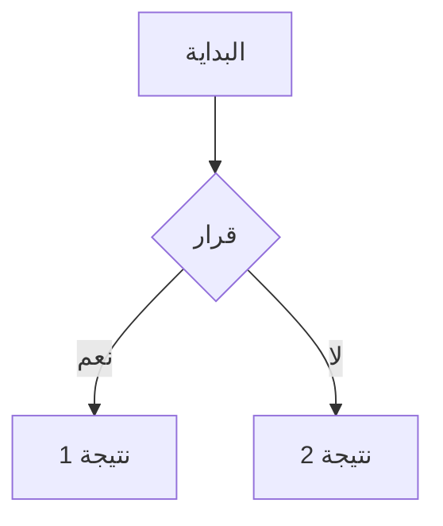
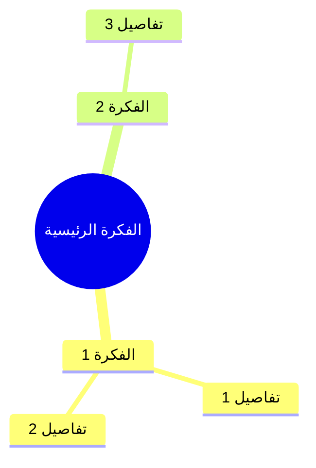
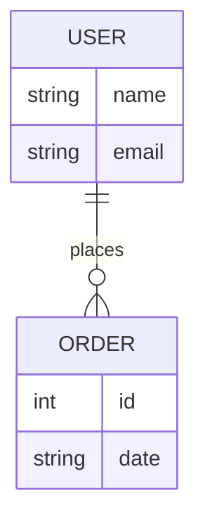

# دليل كتابة المحتوى (Syntax Guide)

هذا الملف يشرح كيفية استخدام الموقع لكتابة الشروحات، المعادلات، والخرائط الذهنية.

## 1. النصوص الأساسية (Markdown)
الموقع يدعم تنسيق Markdown القياسي.

- **العناوين**: استخدم `#` للعنوان الرئيسي، `##` للفرعي، وهكذا.
- **الخط العريض**: ضع النص بين نجمتين `**نص عريض**`.
- **الخط المائل**: ضع النص بين نجمة واحدة `*نص مائل*`.
- **القوائم**: استخدم `-` أو `1.` لبدء قائمة.

## 2. الجداول
يمكنك إنشاء جداول باستخدام الفواصل `|`.

```markdown
| العنوان 1 | العنوان 2 |
|-----------|-----------|
| خلية 1    | خلية 2    |
```

## 3. المعادلات الرياضية (MathJax)
يستخدم الموقع مكتبة MathJax لعرض المعادلات.

### المعادلات العربية (بدون تقطيع الحروف)
المشكلة الشائعة في المعادلات العربية هي ظهور الحروف مقطعة لأن النظام يعتبرها متغيرات منفصلة.
**الحل:** استخدم الأمر `\text{}` لكتابة الكلمات العربية.

**مثال خاطئ:**
`$$ مساحة $$` (ستظهر مقطعة)

**مثال صحيح:**
`$$ \text{مساحة} $$` (ستظهر متصلة وصحيحة)

### أمثلة:
- **قانون فيثاغورس:**
  `$$ a^2 + b^2 = c^2 $$`

- **معادلة عربية:**
  `$$ \text{س} = \frac{-\text{ب} \pm \sqrt{\text{ب}^2 - 4\text{أ}\text{ج}}}{2\text{أ}} $$`

## 4. الخرائط الذهنية (Mermaid)
يدعم الموقع مكتبة Mermaid.js لرسم المخططات.

### المخطط الانسيابي (Flowchart)
يستخدم لتوضيح الخطوات.



### الخريطة الذهنية (Mindmap)
تستخدم لتفريع الأفكار (مدعومة في النسخ الحديثة).



### مخطط الكيان والعلاقة (ER Diagram)
للجداول وقواعد البيانات.



---
**ملاحظة:** لتكبير أو تصغير الخط، استخدم الشريط الموجود في أعلى الصفحة.
